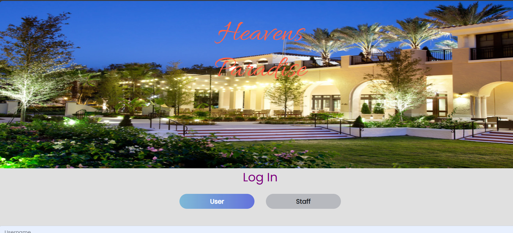
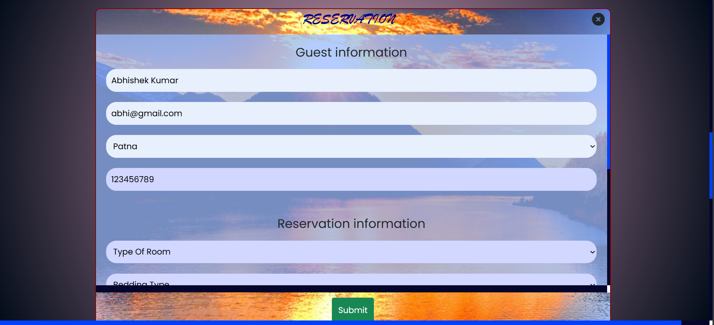
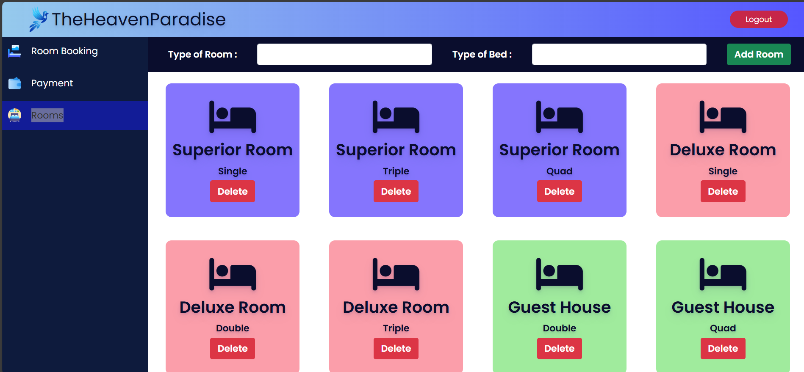
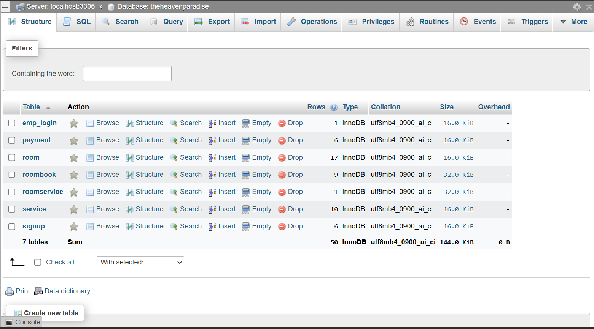

# SmartInn – Hotel Management System

SmartInn is a robust Hotel Management System designed to simplify and digitize hotel operations. Built with an intuitive interface and strong backend integration, it provides seamless room booking, customer management, payment processing, and service handling.

## 🚀 Features

- 🔐 **Login & Authentication** – Secure login system for hotel staff.
- 🏠 **Dashboard** – Centralized view of hotel status and services.
- 🛏️ **Room Booking** – Book rooms by type and availability.
- 📋 **Room & Customer Details** – Manage guest info, room allocation, and booking history.
- 💳 **Payment Integration** – Secure and fast payment record system.
- 📦 **Service Management** – Manage hotel services like food, laundry, and transport.
- 🗄️ **Database Integration** – Efficient storage of customer, room, and transaction data.

## 🖼️ Project Screenshots

| Login Page | Home Page |
|------------|-----------|
|  |  |

| Booking Page | Room Details | Payment Details |
|--------------|--------------|-----------------|
|  |  |  |

| Database Schema |
|-----------------|
|  |

## 🛠️ Technologies Used

- **Frontend:** HTML, CSS, JavaScript
- **Backend:** Python / PHP / Java (based on your implementation)
- **Database:** MySQL / SQLite
- **Tools:** VS Code, XAMPP / WAMP (if applicable)

## 📦 Installation

1. Clone this repository.
2. Set up your database using the provided schema.
3. Launch the server using:
   ```bash
   python app.py
