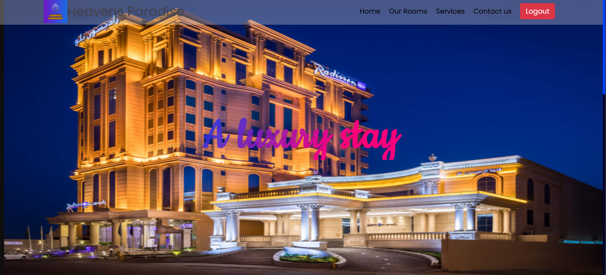

# SmartInn – Hotel Management System

SmartInn is a comprehensive Hotel Management System built with PHP and MySQL, designed to streamline hotel operations. With a clean user interface and secure database integration, it supports everything from room booking to payment tracking.

## 🚀 Features

- 🔐 **Login & Authentication** – Secure login for hotel staff.
- 🏠 **Dashboard** – Overview of rooms, customers, and services.
- 🛏️ **Room Booking** – Book rooms based on type and availability.
- 📋 **Customer & Room Details** – Manage customer data and room assignments.
- 💳 **Payment Details** – Handle and store payment records securely.
- 📦 **Service Management** – Add or manage hotel services.
- 🗄️ **Database Integration** – Backend using MySQL with efficient table structure.

## 🖼️ Project Screenshots

| Login Page | Home Page |
|------------|-----------|
|  |  |

| Booking Page | Room Details | Payment Details |
|--------------|--------------|-----------------|
|  |  |  |

| Database Schema |
|-----------------|
|  |

## 🛠️ Technologies Used

- **Frontend:** HTML, CSS, JavaScript
- **Backend:** PHP
- **Database:** MySQL
- **Server:** Laragon

## 📦 Setup Instructions

1. Copy the **entire project folder** into the `www` directory of **Laragon**.
2. Open **Laragon** and start both:
   - **Apache**
   - **MySQL**
3. Open **phpMyAdmin** from Laragon and import the database using the provided `.sql` file.
4. Now, go to your browser and visit:

